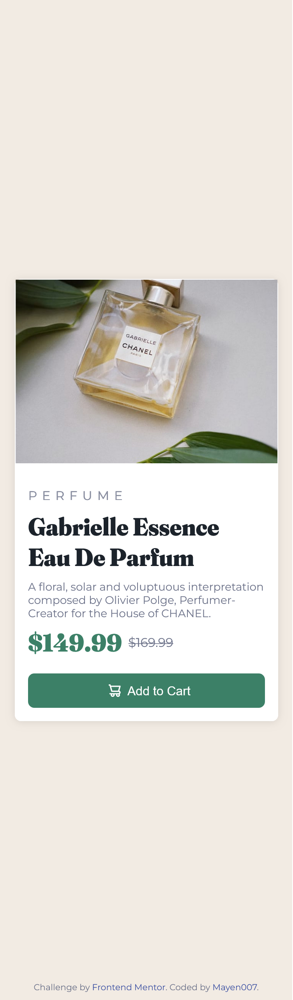

# Frontend Mentor - Product Preview Card Component Solution

This is my solution to the [Product Preview Card Component challenge on Frontend Mentor](https://www.frontendmentor.io/challenges/product-preview-card-component-GO7UmttRfa). This project was a great opportunity to enhance my skills in responsive design using HTML and CSS, focusing on creating a clean, elegant product preview card.

## Table of contents

- [Overview](#overview)
  - [The challenge](#the-challenge)
  - [Screenshots](#screenshots)
  - [Links](#links)
- [My process](#my-process)
  - [Built with](#built-with)
  - [What I learned](#what-i-learned)
  - [Continued development](#continued-development)
  - [Useful resources](#useful-resources)
- [Author](#author)
- [Acknowledgments](#acknowledgments)

## Overview

### The challenge

Users should be able to:

- View the optimal layout for the product card depending on their device's screen size (mobile or desktop)
- See hover and focus states for the "Add to Cart" button

### Screenshots

#### Desktop View


#### Mobile View



### Links

- [Solution URL](https://github.com/Mayen007/product-preview-card) <!-- Add your GitHub repo link -->
- [Live Site URL](https://mayen007.github.io/product-preview-card) <!-- Add your live site link -->

## My process

### Built with

- **Semantic HTML5** for better structure
- **CSS Custom Properties** for maintainable and reusable styling
- **Flexbox** for flexible and responsive layout control
- **Responsive Images** to provide optimal visuals for both mobile and desktop views
- **Mobile-first workflow** to ensure a great user experience on smaller screens

### What I learned

Here are some key learnings from this project:

1. **Font Management with @font-face**:
   - I implemented custom fonts using `@font-face` for a consistent and unique typography style throughout the component.
   ```css
   @font-face {
     font-family: "Fraunces-Italic";
     src: url("./assets/fonts/Fraunces/static/Fraunces_144pt_Soft-Black.ttf")
       format("truetype");
     font-weight: 700;
     font-style: normal;
   }
   ```
2. **Responsive Design Using Media Queries**:

- I used media queries to switch between mobile and desktop layouts. The images are swapped using CSS based on the viewport size.

```css
@media (max-width: 768px) {
  .desktop-image {
    display: none;
  }
  .mobile-image {
    display: block;
  }
}

@media (min-width: 768px) {
  .desktop-image {
    display: block;
  }
  .mobile-image {
    display: none;
  }
}
```

3. **Button Hover Effects**:

- I applied a smooth transition effect to the "Add to Cart" button for a better user interaction experience.

```css
.card-button:hover {
  background-color: var(--dark-cyan-hover);
}
```

### Continued development

Moving forward, I plan to:

- Experiment more with **CSS Grid** for complex layouts
- Enhance my understanding of responsive design techniques like **fluid typography**
- Explore **JavaScript** for adding dynamic interactivity to similar projects

### Useful resources

- [MDN Web Docs - @font-face](https://developer.mozilla.org/en-US/docs/Web/CSS/@font-face) - This helped me understand how to implement custom fonts effectively.
- [CSS Tricks - Media Queries](https://css-tricks.com/css-media-queries/) - A great guide for understanding and utilizing media queries for responsive design.

## Author

- **GitHub** - [Mayen007](https://github.com/Mayen007)
- **Frontend Mentor** - [@Mayen007](https://www.frontendmentor.io/profile/Mayen007)

## Acknowledgments

Thanks to **Frontend Mentor** for providing this challenge, which helped me solidify my understanding of responsive design and CSS techniques.
